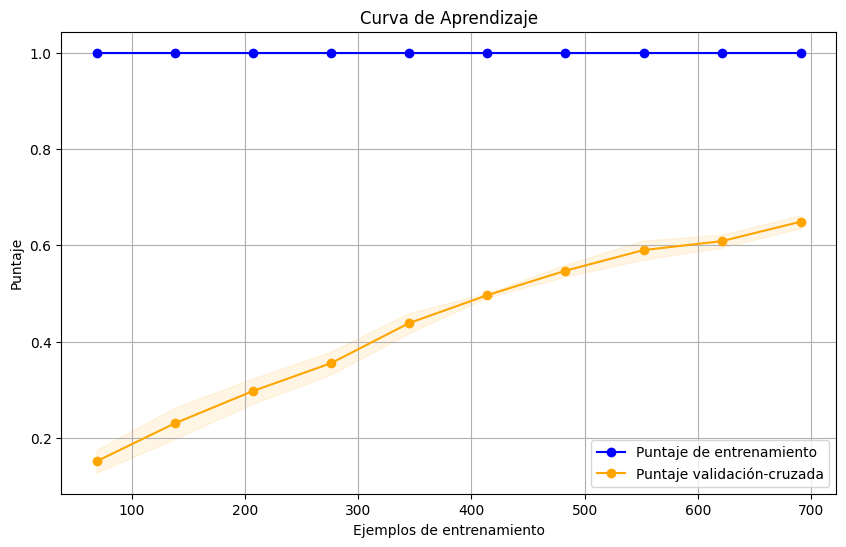
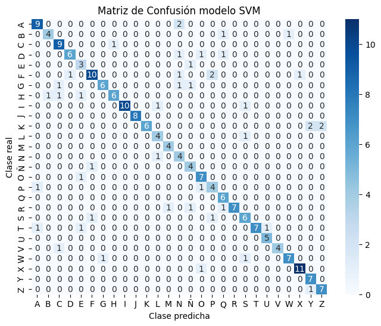
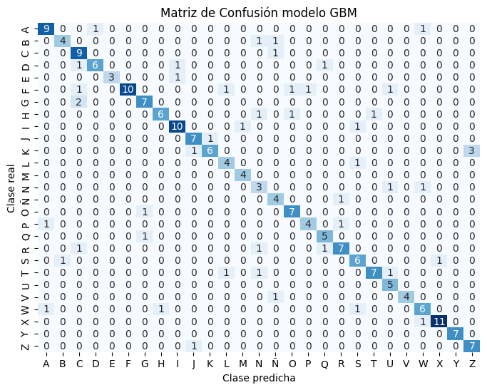

# PIA Mioelectricidad :zap:
---

### Set-up de entorno virtual :wrench:
#### Configuración del entorno de desarrollo

1. **Instalar Pipenv**: Si no lo tienes instalado, instala Pipenv usando pip, el administrador de paquetes de Python. Abre la línea de comandos y ejecuta:

    ```sh
    pip install pipenv
    ```

2. **Clonar el repositorio**: Clona el repositorio en tu máquina local. Abre la línea de comandos, navega al directorio donde quieres clonar el repositorio y ejecuta:

    ```sh
    git clone <url-del-repositorio>
    cd <nombre-del-repositorio>
    ```

3. **Instalar dependencias**: Instala todas las dependencias del proyecto usando el comando `pipenv install`. Este comando creará un entorno virtual si no existe uno y luego instalará todas las dependencias listadas en el `Pipfile.lock`. Abre la línea de comandos y ejecuta:

    ```sh
    pipenv install
    ```

4. **Activar el entorno virtual**: Para activar el entorno virtual creado por Pipenv, ejecuta el siguiente comando en la línea de comandos:

    ```sh
    pipenv shell
    ```

    Ahora estarás en el entorno virtual y podrás ejecutar el código del proyecto.

5. **Instalar dependencias con requirements.txt (alternativa)**: Si prefieres usar `requirements.txt`, puedes instalar todas las dependencias listadas en este archivo usando pip. Primero, crea un entorno virtual usando el comando `python -m venv` y luego actívalo. Después de eso, instala las dependencias usando pip. Abre la línea de comandos y ejecuta:

    ```sh
    pip install -r requirements.txt
    ```

Ahora estarás en el entorno virtual y podrás ejecutar el código del proyecto.


### Resultados modelos de clasificación :bar_chart:

---

#### Modelo SVM 






#### Modelo GBM 

